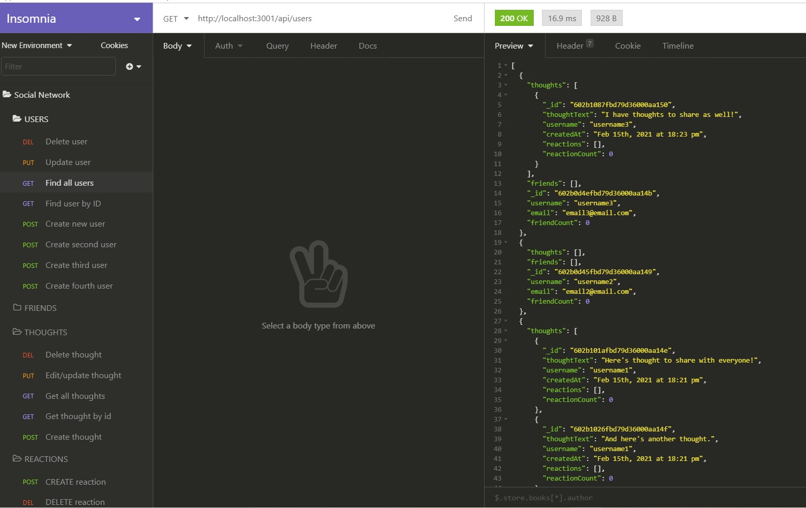

# Social Network Application

## Description and Purpose
A social networking application that performs CRUD methods for users, thoughts, reactions, and replies.

## Table of Contents
  - [Description and Purpose](#description-and-purpose)
  - [Application Screenshot](#application-screenshot)
  - [Demo Videos](#demo-videos)
  - [Built With](#built-with)
  - [License](#license)
  - [Contributing](#contributing)
  - [Tests](#tests)
  - [Questions](#questions)

## Application Screenshot

## Demo Videos
###[Demo Video 1](https://drive.google.com/file/d/1npmcD_MVELoZGa34DEwL2FB5gnztNJMB/view?usp=sharing)
* Starting application server
* User Routes: POST, GET all, GET by id, PUT, DELETE

###[Demo Video 2](https://drive.google.com/file/d/1AtSKuMzq03dPCvKk8eSPnIV_YwH08eNO/view?usp=sharing)
* Thoughts Routes: POST, GET all, GET by id, PUT, DELETE

###[Demo Video 3](https://drive.google.com/file/d/16shqc_-yYRTr4lul6Jz1Dpy3sYEX9ML_/view?usp=sharing)
* Friends Routes: POST, DELETE
* Reaction Routes: POST, DELETE

## Built With
* Node.js
* Express.js
* MongoDB
* Mongoose
## License
MIT License

## Contributing
* Mike Shelby

## Tests
All API end points were tested using Insomnia Core. Utility functions were tested using Jest.

## Questions
Github Username: mikegshelby

Github Profile: https://github.com/mikegshelby

Email: mikegshelby@gmail.com

Please email me with any questions about this project!